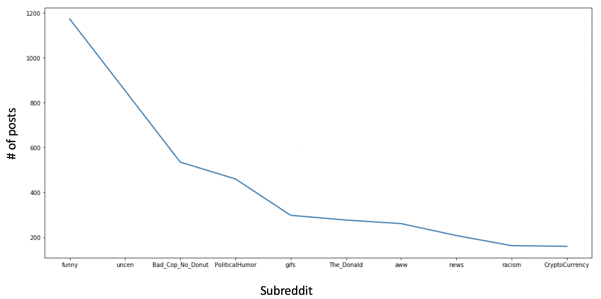
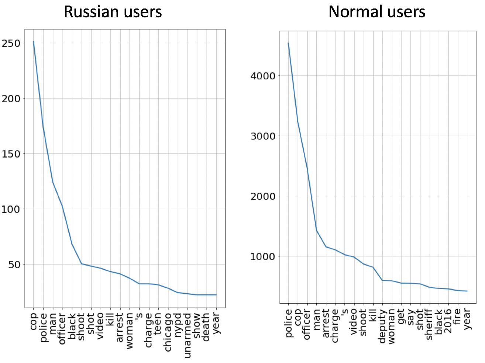
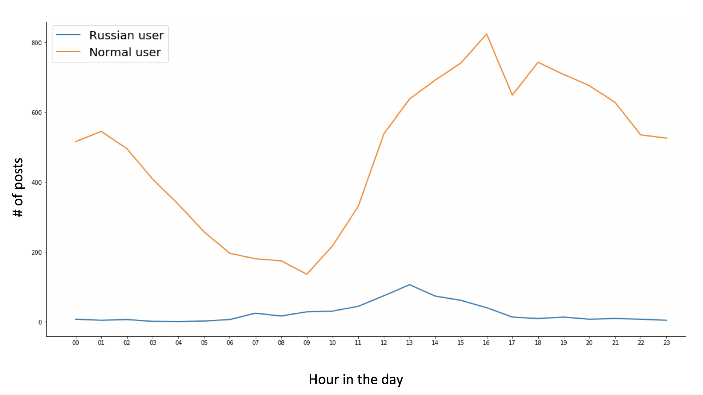
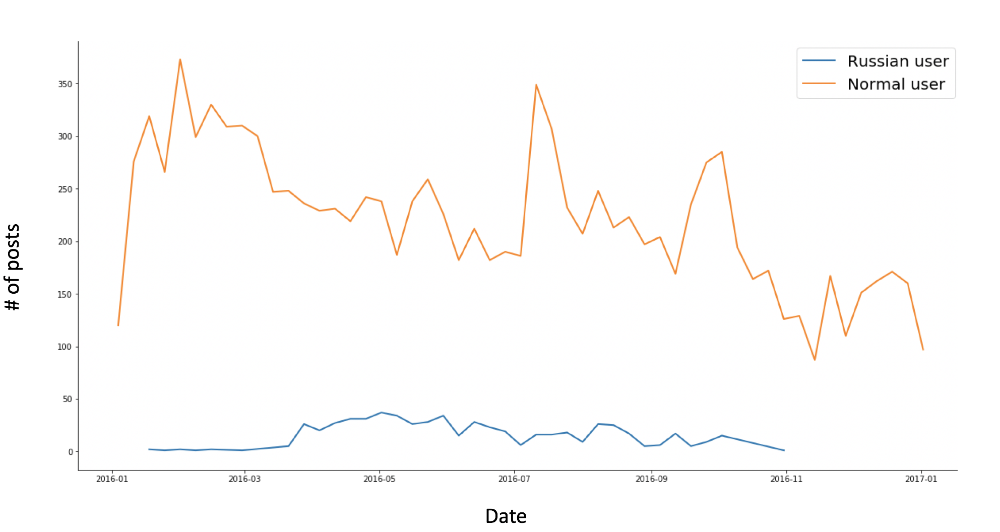
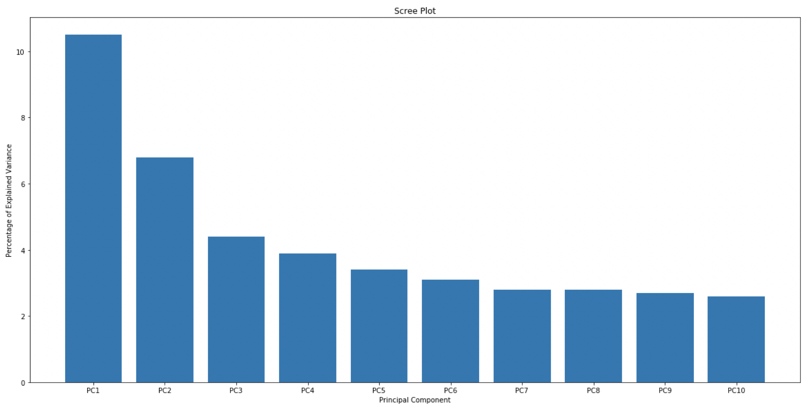

  status of this github repo: <b>incomplete</b>  
  (will update status when complete)

<h2 align="center">STAT 418: Final Project</h1> 
<h3 align= "center">Reddit Data Analysis</h3> 

 <b>Background</b>  
In Reddit’s 2017 transparency report,  a list of 944 accounts suspected to have originated from the Russian Internet Research Agency (IRA). The agency has employed fake accounts to register on major social networking sites to influence the 2016 United States presidential elections. More than 1000 employees are reportedly worked in a single building of the agency in 2015.  

<b>Exploratory Data Analysis</b>  
First I looked at the top 10 subreddits that the Russiana accounts were posting in.

I choose to collect submissions from the subreddit Bad_Cop_No_Donut from Janurary 1, 2016 to December 31, 2016. My dataset had 12,272 submissions total (11,688 from normal accounts and 584 from Russian accounts). Approximately 4.4% of the submissions were made by suspect accounts. 

Then I looked at the top 20 most frequently used words by Russian and normal accounts.

 

The top 4 words in both lists (i.e. police, cop, man, officer) are the same. Also, the 5th most frequently, "black", used word in the Russian user list is the 17th most frequently used word in the normal user list. 

I also compared the number of submissions per week and the number of submissions at each hour of the day for Russian and normal users.

<b>Data Collection</b>  
I used PushShift.io to collect submission ids from the subreddit Bad_Cop_No_Donut . With the collected submission ids I used PRAW to get:
* **id**: submission id
* **author**: submission’s author
* **created_utc**: the Unix time the submission was created
* **is_self**: whether or not the submission is a selfpost (a post you’ve created on reddit, meaning it doesn't link outside of reddit, aka 'text post’)
* **name**: fullname of the submission (same as id but preceded by "t3_")
* **selftext**: submission’s selftext
* **title**: submission's title
* **url**: the URL the submission links to, or the permalink if a self post
 

<b>Preprocessing Text</b>  
For each submission title, I removed stop words and punctuation, converted all words to lower case and lemmatized and tokenized each word.  

<b>Text Frequency - Inverse Document Frequency (TF-IDF)</b>  
<b>PCA</b>  
<b>Model Selection</b>  
<b>Cross Validation</b> 

<!-- + 

  status of this github repo: <b>incomplete</b>  
  (will update status when complete)

 + -->

http://52.27.3.193:8050/
