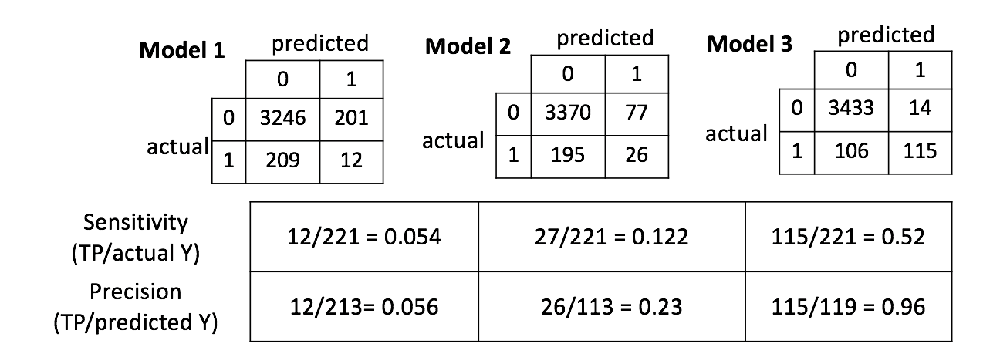

<h2 align="center">STAT 418: Final Project</h2> 
<h3 align= "center">Reddit Submission Analysis of Suspect Accounts</h3> 

1. [Background](README.md#Background)
2. [Exploratory Data Analysis](README.md#Exploratory-Data-Analysis)
3. [Dash App](README.md#Dash-App)

 <b>Background</b>  
In Reddit’s 2017 transparency report,  a list of 944 accounts suspected to have originated from the Russian Internet Research Agency (IRA). The agency has engaged in online influence operations on behalf of Russian business and political interests, including divisive U.S. political and social issues. More than 1000 employees are reportedly worked in a single building of the agency in 2015. 

<b>Exploratory Data Analysis</b> 
First I looked at the top 10 subreddits that the Russian accounts were posting in.

I choose to collect submissions from the subreddit Bad_Cop_No_Donut from Janurary 1, 2016 to December 31, 2016. My dataset has 12,272 submissions (11,688 from normal accounts and 584 from Russian accounts). Approximately 4.4% of the submissions were made by suspect accounts. 

Then I looked at the top 20 most frequently used words by Russian and normal accounts.

 

The top 4 words in both lists (i.e. police, cop, man, officer) are the same. Also, the 5th most frequently, "black", used word in the Russian user list is the 17th most frequently used word in the normal user list. 

I also compared the number of submissions per week and the number of submissions at each hour of the day for Russian and normal users. As you can see in the plots below, the Russian accounts stopped posting after November 2016 and Normal users peaked at 4PM while Russian users peaked at 1PM.

<b>Data Collection</b> 
I used PushShift.io to collect submission ids from the subreddit Bad_Cop_No_Donut . With the collected submission ids I used PRAW to get:
* **id**: submission id
* **author**: submission’s author
* **created_utc**: the Unix time the submission was created
* **is_self**: whether or not the submission is a selfpost (a post you’ve created on reddit, meaning it doesn't link outside of reddit, aka 'text post’)
* **name**: fullname of the submission (same as id but preceded by "t3_")
* **selftext**: submission’s selftext
* **title**: submission's title
* **url**: the URL the submission links to, or the permalink if a self post

<b>Preprocessing Text</b> 
For each submission title, I removed stop words and punctuation, converted all words to lower case and lemmatized and tokenized each word.  

<b>Text Frequency - Inverse Document Frequency (TF-IDF)</b> 
Using my pre-processed submission titles, I converted text into vectors using a method called Term Frequency – Inverse Document (TF – IDF). Term Frequency summarized how often a given word appears within a document (i.e. a submission title) and Inverse Document Frequency down scales words that appear a lot across documents. TF-IDF are word frequency scores that try to highlight words that appear frequency in a document but not across all documents. I calculated TF-IDF for individual words and word pairs.

<b>PCA</b>  
I applied PCA to the TF-IDF vector created from indiviual words to reduce dimensionality. From the scree plot I decided to use the first three components.

<b>Model Selection</b>  
The dataset was split into approximately 70/30 for training and test set. A list of russian users and normal users was created from my dataset. I randomly selected one of the two lists and then randomly selected a users from that list. All of the submissions from that user went into training set until at least 70% of all submissions were in the training set. The remaining submissions became the test set.
 
I created 3 models where the output was whether or not a submission title was posted by a Russian account (1) or not (0).
* Model 1: -3.181 + 1.066 * PC1 + 0.489 * PC2
  * PC1 and PC2 are the first 2 principal components of the PCA. 
* Model 2:-3.573 + 1.279 * cop + 1.643 * black + 1.306 * man + 1.596 * teen
  * cop, black, man and teen refers to the tf-idf score for those words, respectively. 
* Model 3:-3.88+ 6.41 * russian_prop + 0.038 * black_man
  * russian_prop is an indicator of whether or not the submission linked to a Russian propaganda website.

<b>Cross Validation</b> 

From the confusion matrices we can see that tf-idf scores are not a good predictor of whether an account is Russian or not. 

<b>Dash App</b> 
I created a dash plotly app that is hosted on Amazon ec2 [here](http://52.27.3.193:8050/). For more information please see the [README.md](dash_project/README.md) in the dash_project folder. The dash app will be avaliable until June 17, 2017.

<!-- + 

  status of this github repo: <b>incomplete</b>  
  (will update status when complete)

 + -->
